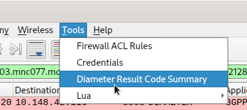
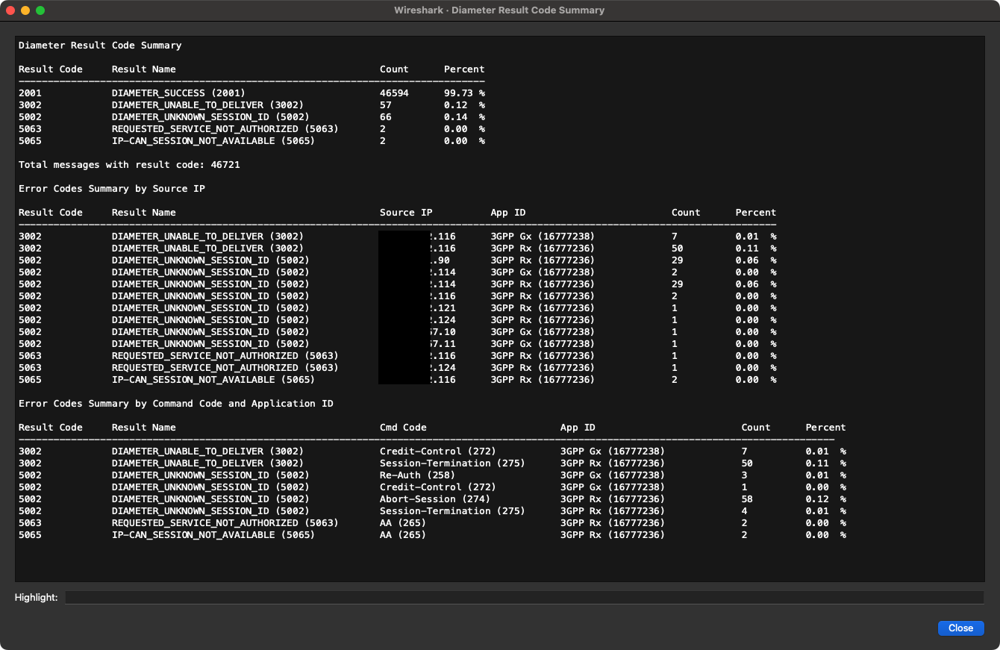

# Here is the directory of wireshark plugins
Actually there are two types of plugins here:
1) pcap2uml plugin for wireshark - please get more information about it in [WIRESHARK_PLUGIN_README](WIRESHARK_PLUGIN_README.md)
2) diameter result summary - separate plugin for pcap with diameter analysis

## Diameter result summary

### Installation:
Copy plugin file [diameter_result_summary.lua](diameter_result_summary.lua) into folder depening on your OS:

   - Linux: `~/.local/lib/wireshark/plugins` or `~/.wireshark/plugins`
   - macOS: `~/Library/Application Support/Wireshark/plugins`
   - Windows: `%APPDATA%\Wireshark\plugins`

Restart wireshark!

### Usage:
1. Open pcap file
2. Go to: Tools -> Diameter result code summary

3. wait for the summary result

Example output:

