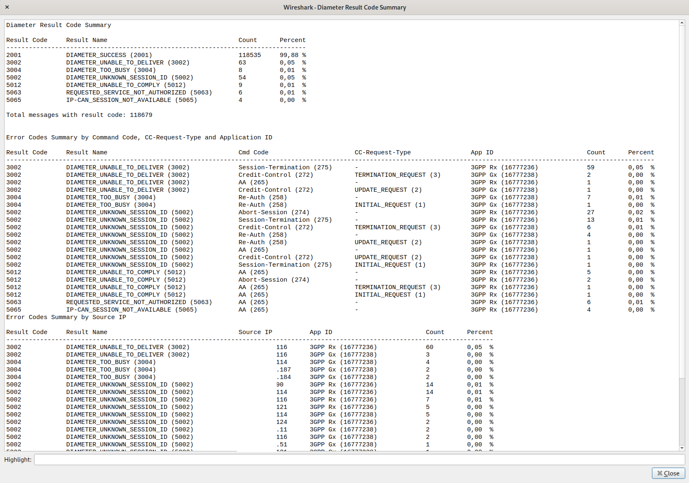

# Here is the directory of wireshark plugins
Actually there are two types of plugins here:
1) pcap2uml plugin for wireshark - please get more information about it in [WIRESHARK_PLUGIN_README](WIRESHARK_PLUGIN_README.md)
2) diameter result summary - separate plugin for pcap with diameter analysis

## Diameter result summary

Example output:

